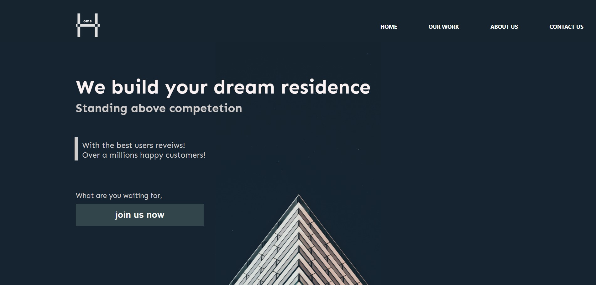

### Project Showcase

## desktop view

## mobile view

## Available Scripts

In the project directory, you can run:

### `npm start` - Runs the app in the development mode.\ [http://localhost:3000](http://localhost:3000)

### `npm run build` - Builds the app for production to the `build` folder.\
